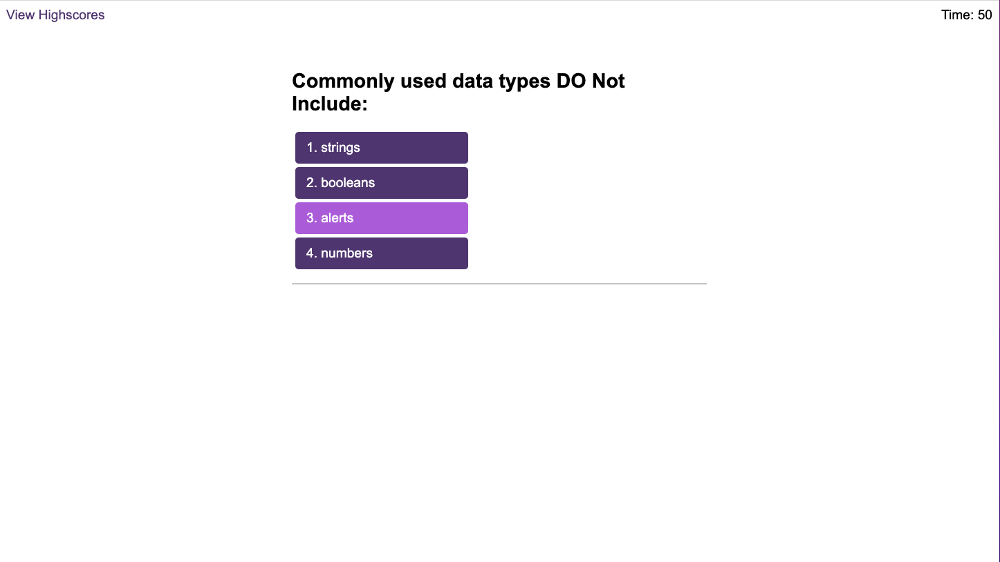

# Code-Quiz
A short, timed quiz on JavaScript fundamentals that stores high scores. (Front-end Bootcamp challenge 6)

## Project Description
For this week's project, we were asked to write a timed coding quiz with multiple-choice questions. Once the user has finished the quiz (or the time was over) the user should be able to save their initials and score to a high scores table. 

For this project, we were provided with a starter code that included responsive HTML pages and CSS. 

The user story for this project was:
"
AS A coding boot camp student
I WANT to take a timed quiz on JavaScript fundamentals that stores high scores
SO THAT I can gauge my progress compared to my peers"

And the acceptance criteria were:
"
GIVEN I am taking a code quiz
WHEN I click the start button
THEN a timer starts and I am presented with a question
WHEN I answer a question
THEN I am presented with another question
WHEN I answer a question incorrectly
THEN time is subtracted from the clock
WHEN all questions are answered or the timer reaches 0
THEN the game is over
WHEN the game is over
THEN I can save my initials and score"

## My Approach

As usual, I started by reading the user story, and acceptance criteria and studying the given starter code.

From studying the starter code I realised we are supposed to be creating 3 different Javascript files:
* logic.js
* questions.js
* scores.js
this allowed me to separate some areas of the project, and think about them separately, but in more detail.

I decided to make notes and try to break down all of the mentioned above files into what functions and variables they will need. Those notes allowed me to have a pretty good starting point when I began to code.

My notes:

* For logic.js:
    * timer function - a countdown function, that will decrease time by one with each second
    * time variable - a variable to hold the time that's left, and that's value will be displayed to the user
    * start quiz function - a function that will start the timer, make the start screen disappear and make the first question appear when the user clicks the start button -> call function inside an eventListener
    * next question function - a function that will make the current question disappear, and make the next question appear
    * check answer function - a function that will check if the answer clicked by the user was correct (call inside an eventListiner on the answer button). If the clicked answer was incorrect then decrease the timer by 10 seconds.
    * end of game function - show the end of the game screen when the user completed the quiz or ran out of time -> if the user completed the game within the time then pause the countdown
    * end game variable - a boolean variable that will be true if the end of the game screen should appear
    * questions array - an array that will hold all the questions from queestions.js (will need to use parse function, as this will be retrieved from local storage)
    * scores array - an array that will hold all user scores and will be saved to local storage, so it can be used in the scores.js file
    * current score - a variable to the hold user's current score -> the score is the time that's left
    * user initials - a variable to store the user's initials

* For questions.js:
    * questions array - an array of questions objects
    * question object - each question needs its own: question text, answers array with answers options, a correct answer 
    * need to store this array in local storage, so it can be used in the logic.js (use JSON.stringfy())

* For questions.js:
    * array of user scores and intials - array accessed from local storage (use JSON.parse())
    * for each element in the array, create a li element and set its text to the score and initilas stored in the current element
    * when users clicks on the clear scores button, make the scores array empty and save the updated version to local storage

* General updates:
    * add hover effect to all buttons on the website
    * increase padding on the buttons

In general I found this task a lot more challenging than the previous ones. I had to refer to the exercises we have done in the class in the past week a lot. The amount of Javascript work was a bit overwhelming to begin with, but it got easier after I made the initial notes and started coding. Overall I have learned a lot by completing this project, not only about Javascript, DOM etc. but also about project management and debugging.

## Credits
I have used the following page: https://stackoverflow.com/questions/16096872/how-to-sort-2-dimensional-array-by-column-value to learn how to sort a two dimension array. 

There wasn't a "copy paste" answer that I could use, but I manipulated what someone have written in the third answer to achieve the result that I wanted. 
## Technologies
This project was made using HTML, CSS ,and Javascript.

## Deployed Website
The deployed website: https://ewagorka.github.io/Code-Quiz/

## Deployed Website Screenshot and GIF

## License
Please refer to the LICENSE in the repo.